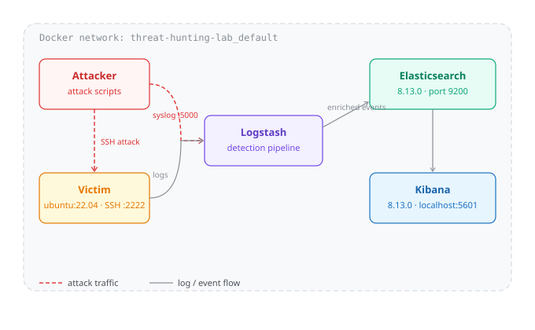
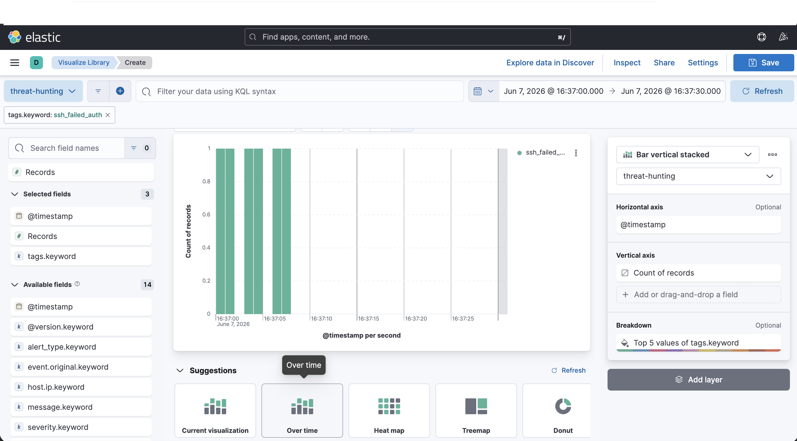
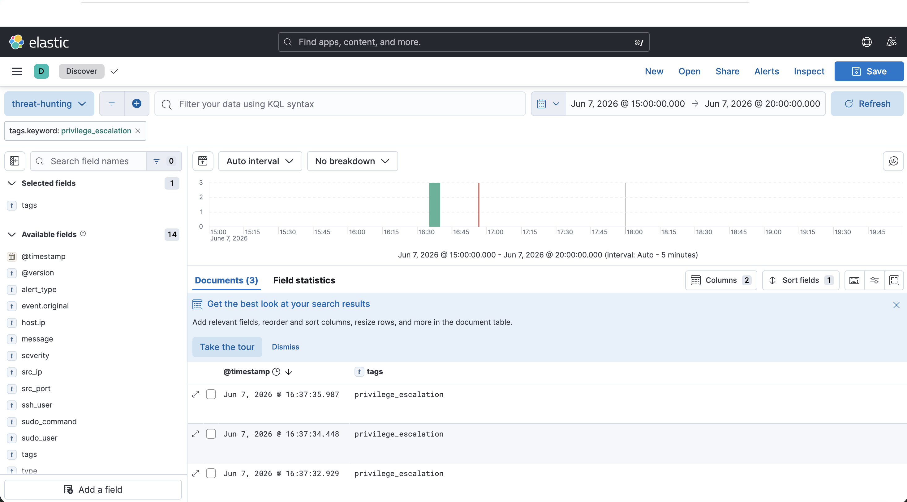
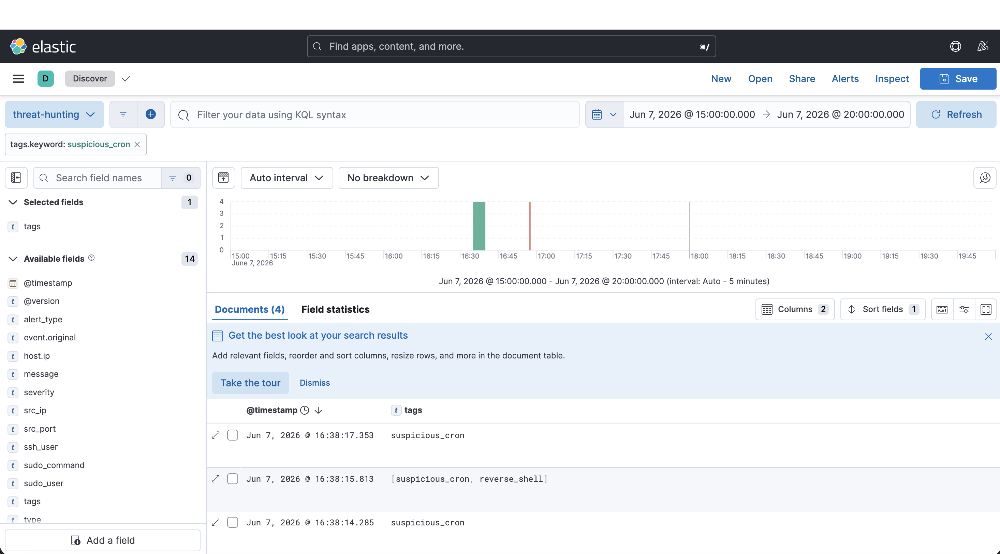

# 🛡️ Threat Hunting Lab


A fully containerised **Blue Team home lab** for practising threat hunting and attack detection using the Elastic Stack (ELK). Simulates real-world attack scenarios and detects them through a custom Logstash detection pipeline feeding into Kibana.

> Built as part of a cybersecurity portfolio targeting SOC Analyst / Blue Team roles.

---

## 📐 Architecture



| Container | Image | Role |
|---|---|---|
| `elasticsearch` | elastic/elasticsearch:8.13.0 | Log storage and search engine |
| `kibana` | elastic/kibana:8.13.0 | Visualisation and alert review |
| `logstash` | elastic/logstash:8.13.0 | Log ingestion and detection rules |
| `victim` | ubuntu:22.04 | Target machine with SSH exposed |

---

## ⚡ Quick Start

### Prerequisites

- Docker Desktop 4.x+
- Docker Compose v2.x+
- `sshpass` (`brew install sshpass` on macOS)
- 4GB RAM available for Docker

### Deploy the lab

```bash
git clone https://github.com/Kriptyon/threat-hunting-lab.git
cd threat-hunting-lab/docker
docker compose up -d
```

Wait ~3 minutes for all containers to be healthy:

```bash
docker compose ps
```

Access Kibana at **http://localhost:5601**

Create a Data View with pattern `threat-hunting-*` and timestamp field `@timestamp`.

---

## 🎯 Attack Scenarios

### Scenario 01 — SSH Brute Force

**MITRE ATT&CK:** T1110.001 — Brute Force: Password Guessing

Simulates an attacker attempting multiple SSH password combinations against the victim machine before finding the correct credential.

**What it does:**
- Sends 7 failed SSH authentication syslog events to the SIEM
- Performs a real SSH login using `sshpass`
- Triggers `alert_type: SSH Failed Authentication` in Kibana

**Run:**
```bash
bash scenarios/01-ssh-brute-force/attack.sh
```

**Kibana filter:** `tags: "ssh_failed_auth"`

---

### Scenario 02 — Privilege Escalation

**MITRE ATT&CK:** T1548.003 — Abuse Elevation Control Mechanism: Sudo

Simulates post-compromise privilege escalation via sudo abuse, SUID binary manipulation, and backdoor user creation.

**What it does:**
- Sends 3 sudo abuse syslog events to the SIEM
- Sets SUID bit on `/bin/bash` on the victim
- Creates a backdoor user account
- Triggers `alert_type: Sudo Command Execution` in Kibana

**Run:**
```bash
bash scenarios/02-privilege-escalation/attack.sh
```

**Kibana filter:** `tags: "privilege_escalation"`

---

### Scenario 03 — Persistence via Cron Job

**MITRE ATT&CK:** T1053.003 — Scheduled Task/Job: Cron

Simulates an attacker establishing persistence by installing malicious cron jobs and hidden scripts on the victim.

**What it does:**
- Sends 4 suspicious cron syslog events to the SIEM
- Installs a real malicious crontab on the victim
- Creates hidden persistence scripts in `/tmp/.hidden/`
- Triggers `alert_type: Cron Job Execution` and `Possible Reverse Shell` in Kibana

**Run:**
```bash
bash scenarios/03-suspicious-cronjob/attack.sh
```

**Kibana filter:** `tags: "suspicious_cron"`

---

## 📸 Screenshots

### SSH Brute Force — Kibana alerts


### Privilege Escalation — Kibana alerts


### Suspicious Cron Job — Kibana alerts


> Screenshots show live Kibana Discover view with enriched fields: `alert_type`, `severity`, `src_ip`, `tags`.

---

## 🔍 Detection Pipeline

Logstash parses incoming syslog events and enriches them with the following fields:

| Field | Description |
|---|---|
| `alert_type` | Human-readable detection name |
| `severity` | `medium`, `high`, or `critical` |
| `tags` | Machine-readable detection tag |
| `src_ip` | Attacker source IP (grok parsed) |
| `ssh_user` | Target username in SSH attacks |
| `sudo_user` | User invoking sudo |
| `sudo_command` | Command executed via sudo |

Detection rules are defined in `logstash/pipeline/main.conf`.

---

## 📁 Repository Structure
threat-hunting-lab/
├── docker/
│   └── docker-compose.yml          # Full lab stack
├── logstash/
│   └── pipeline/
│       └── main.conf               # Detection rules
├── scenarios/
│   ├── 01-ssh-brute-force/
│   │   └── attack.sh               # SSH brute force simulation
│   ├── 02-privilege-escalation/
│   │   └── attack.sh               # Privilege escalation simulation
│   └── 03-suspicious-cronjob/
│       └── attack.sh               # Cron persistence simulation
├── docs/
│   ├── architecture.svg            # Network architecture diagram
│   └── screenshots/                # Kibana alert screenshots
└── README.md

---

## 🧹 Teardown

```bash
cd docker
docker compose down -v
```

This removes all containers and volumes. Re-run `docker compose up -d` to start fresh.

---

## 📚 References

- [Elastic Stack Documentation](https://www.elastic.co/guide/index.html)
- [MITRE ATT&CK Framework](https://attack.mitre.org/)
- [Logstash Grok Patterns](https://www.elastic.co/guide/en/logstash/current/plugins-filters-grok.html)

---

## 👤 Author

**Sebastián García** — IT Professional transitioning into Blue Team / SOC
GitHub: [@Kriptyon](https://github.com/Kriptyon)
Certifications: ISO/IEC 27001:2022 Internal Auditor · AWS Cloud Fundamentals · Cyber Security 101 (SEC1)

---

*This lab is for educational purposes only. All attack simulations are performed in an isolated Docker environment.*
